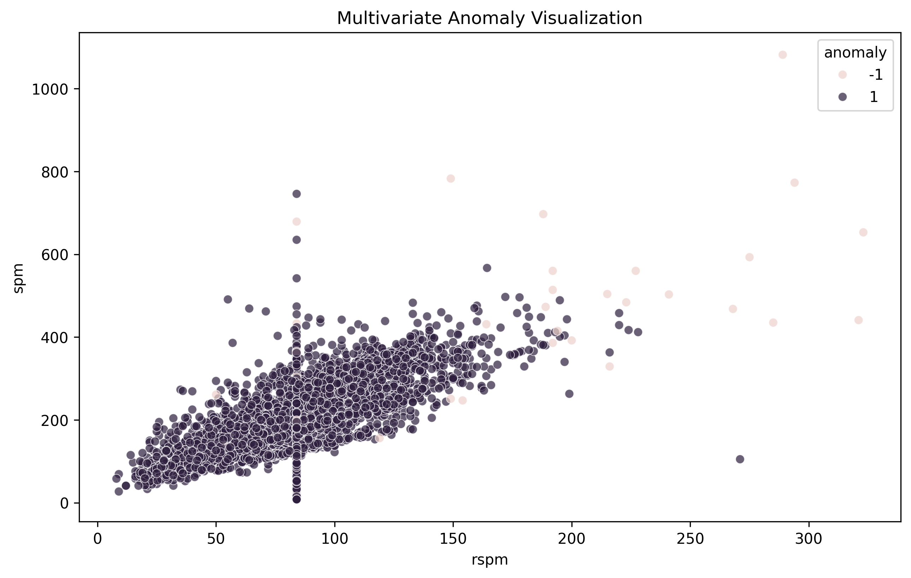
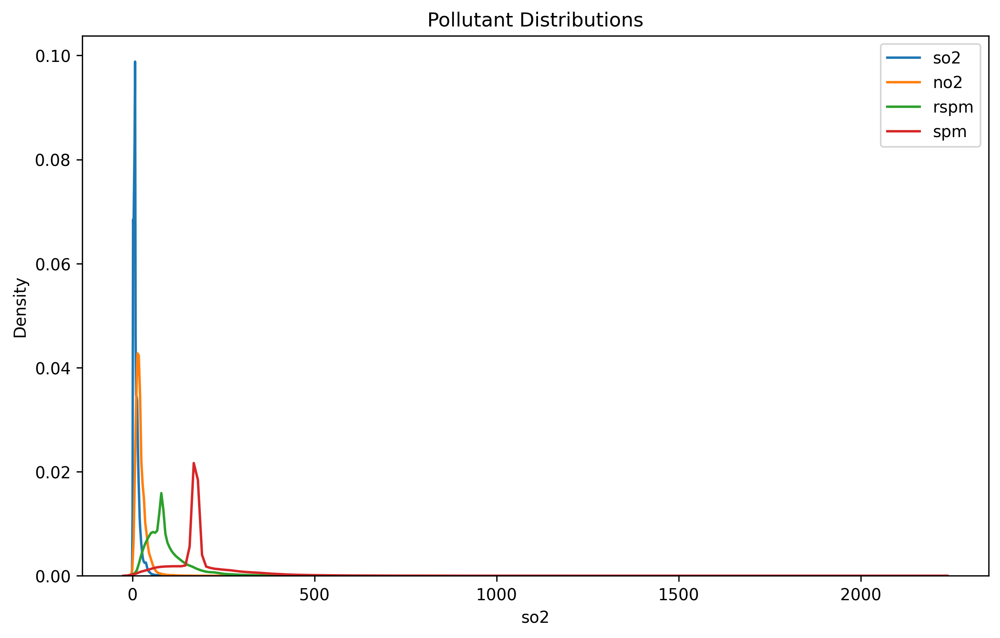
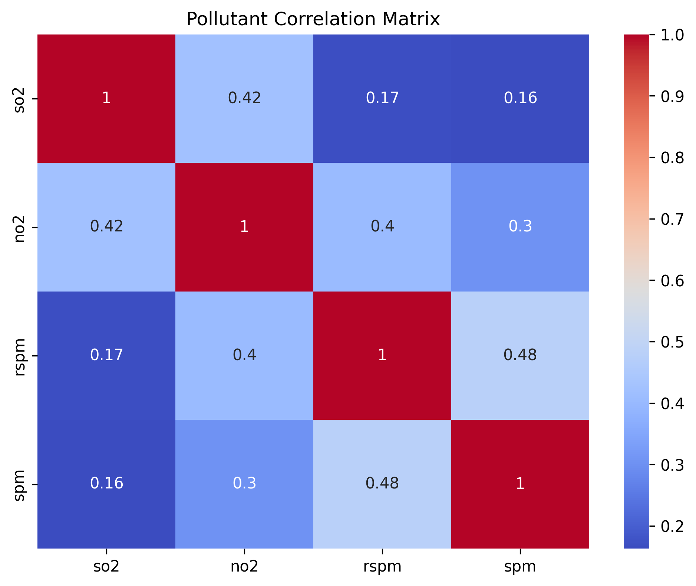
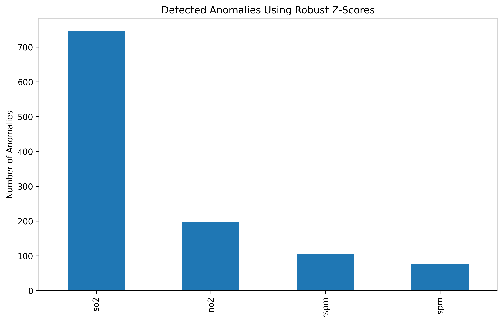
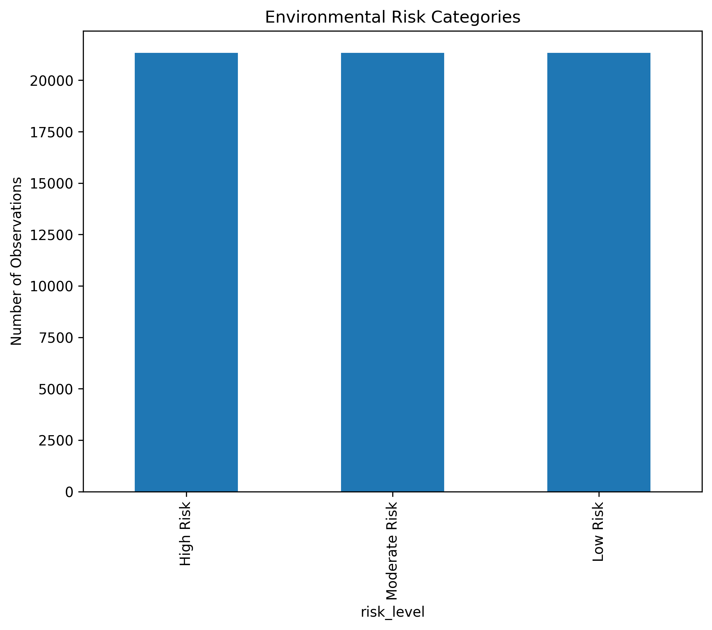

# Statistical Anomaly Detection System


## Overview

The Statistical Anomaly Detection System is a computational statistics project designed to identify unusual environmental pollution patterns using robust statistical methods and multivariate anomaly detection techniques.

Using a large-scale air quality monitoring dataset from India containing over 260,000 observations, the project applies exploratory data analysis, robust statistical modeling, and machine learning-based anomaly detection to identify abnormal pollution events that may warrant further investigation.

The framework demonstrates how statistical methods can support environmental monitoring, risk assessment, and data-driven decision-making in complex, high-dimensional settings.

---

## Project Objectives

* Analyze large-scale environmental pollution data
* Investigate pollutant distributions and relationships
* Detect extreme observations using robust statistical methods
* Identify multivariate anomalies using machine learning
* Develop an environmental risk categorization framework
* Generate actionable alerts for environmental monitoring

---

## Research Question

Can robust statistical techniques and multivariate anomaly detection methods effectively identify unusual pollution events within large-scale environmental monitoring data?

---

## Dataset

This project uses the Air Quality Data in India dataset, which contains environmental monitoring records collected across multiple locations and time periods.

### Dataset Characteristics

* Over 260,000 observations
* Multiple air quality monitoring locations
* Environmental pollutant measurements
* Longitudinal environmental monitoring records

### Key Variables

* Sulfur Dioxide (SO₂)
* Nitrogen Dioxide (NO₂)
* Respirable Suspended Particulate Matter (RSPM)
* Suspended Particulate Matter (SPM)

---

## Methodology

### 1. Data Collection and Preprocessing

* Missing value assessment
* Data quality evaluation
* Variable selection
* Data cleaning and preparation

### 2. Exploratory Statistical Analysis

* Distribution analysis
* Correlation analysis
* Outlier exploration
* Temporal trend assessment

### 3. Robust Statistical Modeling

To reduce sensitivity to extreme observations, robust statistical methods were applied:

* Median-based estimation
* Median Absolute Deviation (MAD)
* Robust Z-Score analysis

### 4. Multivariate Anomaly Detection

An Isolation Forest algorithm was used to identify observations exhibiting unusual multivariate pollutant behavior.

### 5. Risk Categorization

Detected observations were categorized into:

* High Risk
* Moderate Risk
* Low Risk

to support environmental monitoring and decision-making.

---

## Key Findings

## Distributional Characteristics



Exploratory analysis revealed strongly skewed pollutant distributions with substantial evidence of heavy-tailed behavior and extreme observations.

### Correlation Structure



Moderate positive relationships were observed among several pollutants:

| Variable Pair | Correlation |
| ------------- | ----------: |
| SO₂ and NO₂   |       0.423 |
| NO₂ and RSPM  |       0.403 |
| RSPM and SPM  |       0.480 |

These findings suggest meaningful multivariate dependence structures within the environmental system.

### Robust Statistical Analysis



Robust Z-Score analysis identified substantial numbers of extreme observations:

| Pollutant | Detected Anomalies |
| --------- | -----------------: |
| SO₂       |                746 |
| NO₂       |                196 |
| RSPM      |                106 |
| SPM       |                 77 |

SO₂ exhibited the greatest concentration of anomalous observations, indicating higher variability and heavier-tailed behavior.

### Multivariate Anomaly Detection

Isolation Forest identified:

* 9,109 normal observations
* 93 anomalous observations

representing approximately 1% of the analyzed sample.

The detected anomalies were characterized by unusually large pollutant concentrations that differed substantially from the dominant environmental patterns.

### Environmental Risk Assessment



The alert generation framework classified observations into:

| Risk Level    |  Count |
| ------------- | -----: |
| High Risk     | 21,340 |
| Moderate Risk | 21,340 |
| Low Risk      | 21,340 |

This risk categorization framework provides an interpretable mechanism for environmental monitoring and anomaly reporting.

---

## Technologies

* Python
* Pandas
* NumPy
* Matplotlib
* Seaborn
* Scikit-Learn
* SciPy
* Jupyter Notebook

---

## Project Structure

```text
statistical-anomaly-detection-system/
│
├── data/
├── images/
├── notebooks/
│   ├── 01_data_collection.ipynb
│   ├── 02_exploratory_analysis.ipynb
│   ├── 03_robust_statistics.ipynb
│   ├── 04_multivariate_anomaly_detection.ipynb
│   ├── 05_alert_generation_system.ipynb
│   └── 06_model_evaluation_and_dashboard.ipynb
│
├── README.md
├── requirements.txt
└── LICENSE
```

---

## Statistical Techniques Demonstrated

* Exploratory Data Analysis
* Correlation Analysis
* Robust Statistics
* Median Absolute Deviation (MAD)
* Robust Z-Scores
* Multivariate Statistical Analysis
* Isolation Forest Anomaly Detection
* Risk Categorization
* Environmental Monitoring Analytics

---

## Portfolio Relevance

This project demonstrates practical applications of:

* Computational Statistics
* High-Dimensional Statistical Modeling
* Robust Statistical Methods
* Environmental Data Analytics
* Machine Learning for Anomaly Detection
* Data-Driven Decision Support Systems

---

## Future Enhancements

* Real-time anomaly monitoring
* Streaming data integration
* Bayesian anomaly detection
* Extreme value modeling
* Spatial anomaly detection
* Interactive dashboard deployment

---

## Author

**Clement Kofi Okyere Biew**

Statistics | Data Science | Computational Statistics | Machine Learning | Quantitative Research
