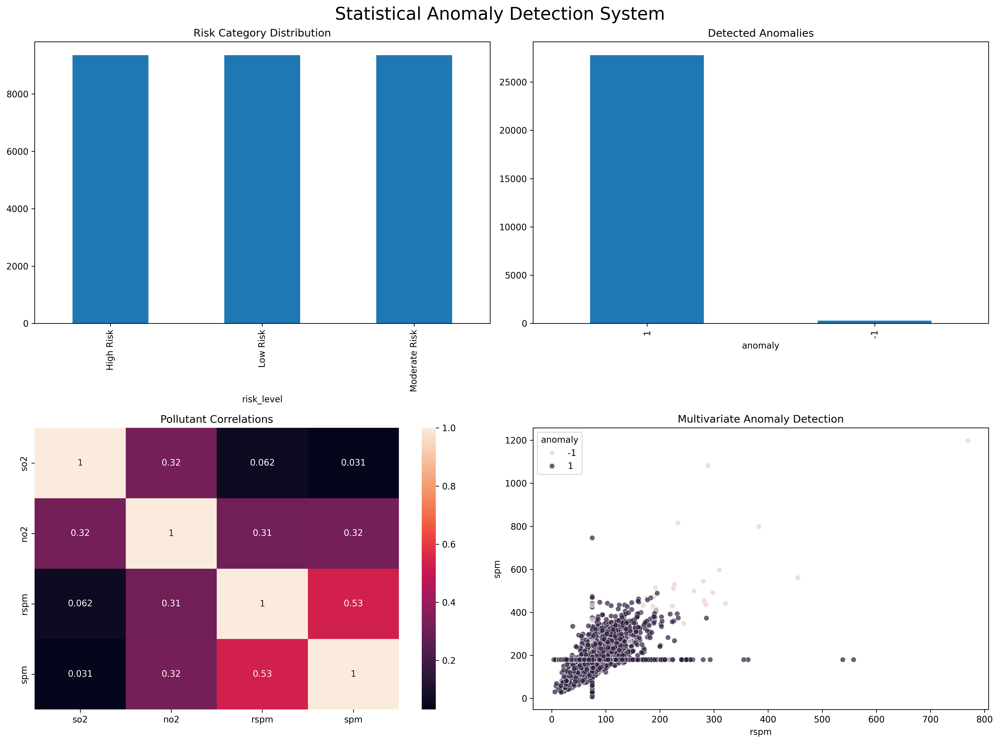

# Statistical Anomaly Detection System


## Executive Summary

The Statistical Anomaly Detection System is a computational statistics project designed to identify unusual environmental pollution patterns using robust statistical methods and multivariate anomaly detection techniques.

Using a large-scale air quality monitoring dataset from India containing over 260,000 observations, the project applies exploratory data analysis, robust statistical modeling, and machine learning-based anomaly detection to identify abnormal pollution events that may warrant further investigation.

The framework demonstrates how computational statistics, robust statistical methods, and statistical learning techniques can support environmental monitoring, risk assessment, and evidence-based decision-making in complex, high-dimensional settings.

---

## Research Question

**Can robust statistical techniques and multivariate anomaly detection methods effectively identify unusual pollution events within large-scale environmental monitoring data?**

---

## Dataset

This project utilizes the Air Quality Data in India dataset, containing environmental monitoring records collected across multiple locations and time periods.

### Dataset Characteristics

* 260,621 observations
* Multiple air quality monitoring stations
* Environmental pollutant measurements
* Longitudinal monitoring records

### Key Variables

| Variable | Description                             |
| -------- | --------------------------------------- |
| SO₂      | Sulfur Dioxide Concentration            |
| NO₂      | Nitrogen Dioxide Concentration          |
| RSPM     | Respirable Suspended Particulate Matter |
| SPM      | Suspended Particulate Matter            |

### Data Preparation

The dataset contained missing observations across several variables. Median imputation was applied to preserve robustness against extreme values while maintaining data integrity for downstream statistical analyses.

---

## Project Objectives

* Analyze large-scale environmental pollution data
* Investigate pollutant distributions and relationships
* Detect extreme observations using robust statistical methods
* Identify multivariate anomalies using machine learning
* Develop an environmental risk categorization framework
* Generate actionable alerts for environmental monitoring

---

## Methodology

### Phase 1 — Data Collection and Preprocessing

* Missing value assessment
* Data quality evaluation
* Median imputation
* Variable selection and cleaning

### Phase 2 — Exploratory Statistical Analysis

* Distribution analysis
* Correlation analysis
* Outlier investigation
* Exploratory visualization

### Phase 3 — Robust Statistical Modeling

To reduce sensitivity to extreme observations, robust statistical techniques were applied:

* Median estimation
* Median Absolute Deviation (MAD)
* Robust Z-Score Analysis

### Phase 4 — Multivariate Anomaly Detection

An Isolation Forest algorithm was implemented to identify observations exhibiting unusual multivariate pollutant behavior.

### Phase 5 — Environmental Risk Assessment

Anomaly scores were transformed into interpretable environmental risk categories:

* High Risk
* Moderate Risk
* Low Risk

---

# Key Findings

## 1. Distributional Characteristics


Exploratory analysis revealed strongly skewed pollutant distributions with substantial evidence of heavy-tailed behavior and extreme observations.

The observed distributional structure suggests that traditional mean-based methods may be insufficient for characterizing pollution dynamics and motivates the use of robust statistical techniques.

---

## 2. Correlation Structure


Moderate positive relationships were observed among several pollutants.

| Variable Pair | Correlation |
| ------------- | ----------: |
| SO₂ and NO₂   |       0.423 |
| NO₂ and RSPM  |       0.403 |
| RSPM and SPM  |       0.480 |

These relationships indicate meaningful multivariate dependence structures and justify the application of multivariate anomaly detection methods.

---

## 3. Robust Statistical Analysis


Robust Z-Score analysis identified substantial numbers of extreme observations.

| Pollutant | Detected Anomalies |
| --------- | -----------------: |
| SO₂       |                746 |
| NO₂       |                196 |
| RSPM      |                106 |
| SPM       |                 77 |

SO₂ exhibited the highest concentration of anomalous observations, suggesting greater variability and heavier-tailed behavior relative to the remaining pollutants.

### Mean vs Median Comparison

| Variable |   Mean | Median |
| -------- | -----: | -----: |
| SO₂      |   7.73 |   5.50 |
| NO₂      |  27.33 |  29.00 |
| RSPM     |  83.17 |  84.00 |
| SPM      | 197.30 | 181.00 |

The differences between means and medians provide additional evidence of skewed distributions and outlier influence.

---

## 4. Multivariate Anomaly Detection


Isolation Forest identified:

| Classification         | Count |
| ---------------------- | ----: |
| Normal Observations    | 9,109 |
| Anomalous Observations |    93 |

Approximately 1% of analyzed observations were classified as anomalous.

The detected anomalies exhibited unusual pollutant combinations and elevated particulate concentrations that differed substantially from dominant environmental patterns.

Unlike univariate approaches, Isolation Forest simultaneously evaluates multiple pollutant measurements, enabling the detection of complex environmental anomalies.

---

## 5. Environmental Risk Assessment


Anomaly scores were converted into interpretable environmental risk categories.

| Risk Level    |  Count |
| ------------- | -----: |
| High Risk     | 21,340 |
| Moderate Risk | 21,340 |
| Low Risk      | 21,340 |

The resulting framework provides a practical mechanism for environmental monitoring, anomaly prioritization, and risk communication.

---

## Research Question Answered

The results demonstrate that robust statistical techniques and multivariate anomaly detection methods can successfully identify unusual environmental pollution events within large-scale monitoring datasets.

Robust statistical analysis revealed significant heavy-tailed behavior and extreme observations, particularly for sulfur dioxide (SO₂), where 746 anomalies were detected using robust z-score methods.

Furthermore, the multivariate Isolation Forest framework identified 93 anomalous observations exhibiting unusual pollutant combinations that would likely remain undetected using traditional univariate approaches.

These findings support the effectiveness of computational statistics and machine learning techniques for environmental surveillance, anomaly detection, and decision-support applications.

---

## Practical Implications

The developed framework can support:

* Environmental monitoring systems
* Pollution surveillance programs
* Environmental risk assessment
* Regulatory compliance investigations
* Public health monitoring initiatives
* Data-driven environmental policy development

By identifying unusual pollution events early, environmental stakeholders can prioritize investigations and allocate monitoring resources more effectively.

---

## Project Dashboard

The dashboard below summarizes the primary outputs of the anomaly detection framework.



The dashboard integrates correlation analysis, anomaly detection, environmental risk categorization, and multivariate pollutant relationships into a unified reporting interface.

---

## Technologies

* Python
* Pandas
* NumPy
* SciPy
* Matplotlib
* Seaborn
* Scikit-Learn
* Jupyter Notebook

---

## Statistical Techniques Demonstrated

* Exploratory Data Analysis
* Correlation Analysis
* Robust Statistics
* Median Absolute Deviation (MAD)
* Robust Z-Score Analysis
* Multivariate Statistical Analysis
* Isolation Forest Anomaly Detection
* Environmental Risk Categorization
* Decision Support Analytics

---

## Skills Demonstrated

* Computational Statistics
* High-Dimensional Statistical Modeling
* Robust Statistical Methods
* Statistical Learning
* Environmental Data Analytics
* Machine Learning
* Scientific Reporting
* Data Visualization

---

## Repository Structure

```text
statistical-anomaly-detection-system/
│
├── data/
├── images/
├── notebooks/
│   ├── 01_data_collection.ipynb
│   ├── 02_exploratory_analysis.ipynb
│   ├── 03_robust_statistics.ipynb
│   ├── 04_multivariate_anomaly_detection.ipynb
│   ├── 05_alert_generation_system.ipynb
│   └── 06_model_evaluation_and_dashboard.ipynb
│
├── README.md
├── requirements.txt
└── LICENSE
```

---

## Future Enhancements

* Bayesian Anomaly Detection
* Real-Time Monitoring Systems
* Spatial Statistical Modeling
* Extreme Value Analysis
* Interactive Dashboard Deployment
* Streaming Environmental Data Integration

---

## References

1. Hastie, Tibshirani, & Friedman. *The Elements of Statistical Learning*.
2. James, Witten, Hastie, & Tibshirani. *An Introduction to Statistical Learning*.
3. Huber, P. J. *Robust Statistics*.
4. Scikit-Learn Documentation.
5. Air Quality Data in India Dataset.

---

## Author

**Clement Kofi Okyere Biew**

Statistics | Data Science | Computational Statistics | Statistical Learning | Machine Learning | Quantitative Research
